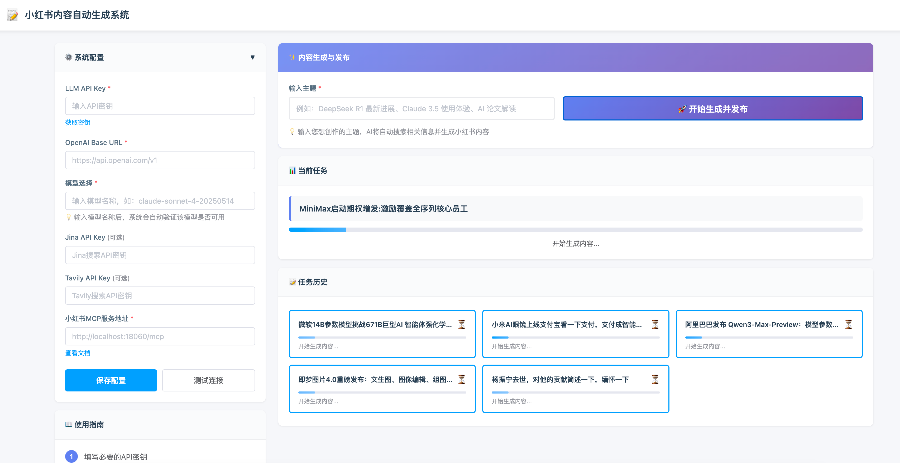
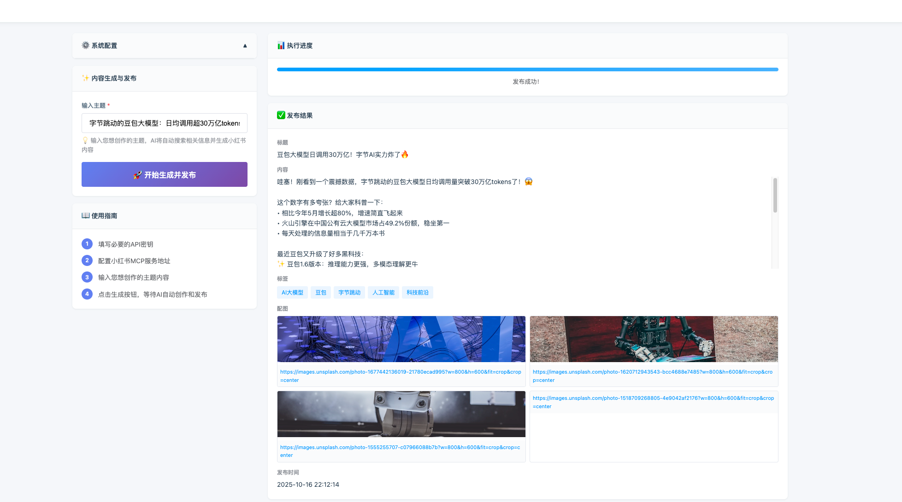
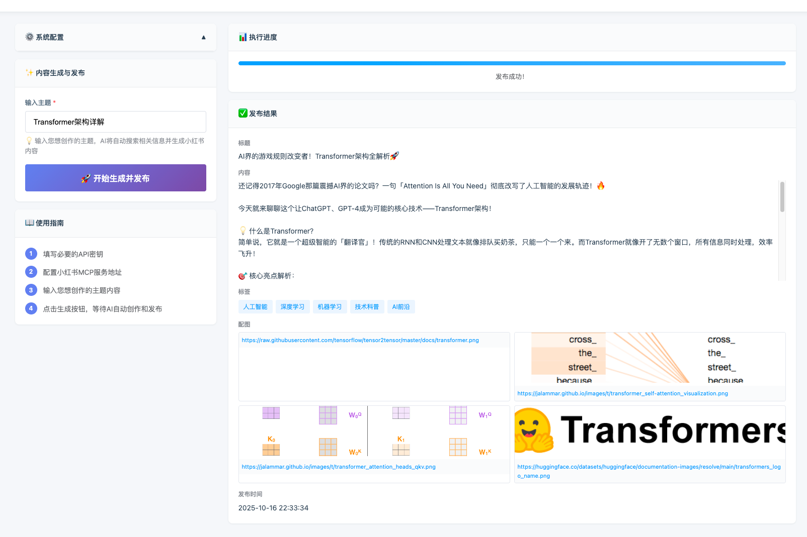

# 小红书内容自动生成与发布系统

中文 | [English](README_EN.md)

一个基于AI的智能小红书内容生成和自动发布Web应用，通过MCP（Model Context Protocol）集成多种工具服务，
实现从主题输入到内容发布的全自动化流程。

简单来说：输入一个主题所有 AI 帮你搞定，直接发布到你的小红书账号上

系统主界面：



## ✨ 功能特点

- 🎨 **现代化Web界面** - 简洁美观的左右分栏布局，响应式设计
- ⚙️ **配置管理** - 所有配置通过Web界面输入，自动保存到配置文件
- 🔌 **MCP服务集成** - 集成Jina搜索、Tavily搜索、小红书发布三大MCP服务
- 🤖 **智能内容生成** - 基于用户主题自动检索资料、分析整理、撰写文章
- 📝 **自动格式化** - 自动适配小红书发布格式（标题、正文、标签、配图）
- 🚀 **一键发布** - 生成完成后自动发布到小红书平台
- 📊 **实时进度** - 显示执行进度和状态信息
- ✅ **结果展示** - 展示最终发布的标题、内容、标签、配图等信息
- 🔥 **热点主题推荐** - 自动获取今日热点新闻，智能提取主题供选择
- 🎯 **批量生成发布** - 支持批量选择多个主题，一键批量生成并发布
- 🌐 **URL内容提取** - 支持输入网页链接，自动爬取并提取主题内容
- 🏷️ **领域快速筛选** - 提供AI、融资、论文、机器人等领域快捷筛选按钮

**打个广告**

这是我自己运营的账号，全部由这个项目写出来的文章


[个人主页](https://www.xiaohongshu.com/user/profile/60857eed0000000001008826)欢迎查看，点点关注，带你获取一手的 AI 资源


## 📋 前置要求

### 1. 启动小红书MCP服务

**必须先启动 [xiaohongshu-mcp](https://github.com/xpzouying/xiaohongshu-mcp) 服务**


```bash
# 1. 克隆小红书MCP项目
git clone https://github.com/xpzouying/xiaohongshu-mcp.git
cd xiaohongshu-mcp

# 2. 按照项目README的说明启动服务
# 默认服务地址: http://localhost:18060/mcp
```
⚠️注意：要先登录自己的小红书账号（按照这个 mcp 服务里面的方式来进行登录）
### 2. 系统环境

- Python 3.8+
- Node.js 16+ (用于MCP工具)
- npm/npx (用于运行MCP工具)

## 🚀 快速开始

### 1. 安装依赖

```bash
cd xhs_web_app
pip install -r requirements.txt
```

### 2. 启动应用

```bash
python app.py
```

应用默认在 `http://localhost:8080` 启动。

### 3. 配置系统

访问 `http://localhost:8080`，在左侧面板配置以下信息：

#### 必填配置

| 配置项 | 说明 | 示例 |
|--------|------|------|
| **LLM API Key** | OpenAI兼容的API密钥 | `sk-xxx...` |
| **OpenAI Base URL** | API基础地址 | `https://api.openai.com/v1` 或 `https://usw.sealos.io/v1` |
| **默认模型** | 使用的LLM模型 | `claude-sonnet-4-20250514` (推荐) |
| **小红书MCP服务地址** | MCP服务的URL | `http://localhost:18060/mcp` |

#### 可选配置

| 配置项 | 说明 | 获取方式 |
|--------|------|----------|
| **Jina API Key** | Jina搜索服务密钥 | [Jina官网](https://jina.ai/) |
| **Tavily API Key** | Tavily搜索服务密钥 | [Tavily官网](https://tavily.com/) |

推荐使用 Tavily 作为搜索工具，每个月能白嫖 1000 次搜索请求

> 💡 **提示**: 点击配置项旁边的"获取密钥"或"查看文档"链接可直接跳转到对应的服务网站。


### 4. 生成内容

系统提供两种内容生成方式：

#### 方式一：手动输入主题

1. 在"内容生成与发布"区域输入主题
2. 点击"🚀 开始生成并发布"按钮
3. 在右侧查看执行进度和最终结果

**主题示例：**
- "字节跳动的豆包大模型：日均调用超30万亿tokens，增长势头惊人！"

- "Transformer架构详解"


#### 方式二：热点主题自动生成（推荐）

系统提供了智能热点主题获取功能，帮助你快速找到优质选题：

##### 1. 按领域获取热点

在"今日热点主题"面板中，点击领域标签快速获取该领域的热门话题：

- 🤖 **AI** - 人工智能、大模型、机器学习相关热点
- 💰 **融资** - 投融资消息、创业公司动态
- 📄 **论文** - 最新研究论文、学术进展
- 🦾 **机器人** - 机器人技术、自动化相关

系统会自动调用网络搜索工具，检索最近24小时内该领域最热门的10个新闻话题。

##### 2. 从网页链接提取主题

如果你发现了一篇优质文章或报道，可以：

1. 在"或输入网页链接提取主题"输入框中粘贴URL
2. 点击"🔍 提取主题"按钮
3. 系统会自动爬取网页内容，智能提取其中最有价值的10个主题

##### 3. 选择主题批量生成

获取热点主题后：

1. **单选/多选主题** - 勾选感兴趣的主题（每个主题包含标题和摘要）
2. **全选功能** - 点击"✓ 全选"按钮可快速选择所有主题
3. **查看选择数量** - 页面会实时显示"已选择 X 个主题"
4. **批量生成** - 点击"🚀 批量生成选中主题"按钮
5. **查看结果** - 系统会依次生成和发布每个主题，并显示成功/失败统计

##### 4. 实时进度追踪

- 选中的主题会自动同步到"当前任务"面板
- 批量生成时显示整体进度条和详细状态
- 每个主题的生成结果会保存到"任务历史"中
- 失败的任务可以点击"🔄 重试"按钮重新执行

**使用技巧：**
- 建议先使用领域标签快速获取当日热点
- 批量生成时建议每次选择3-5个主题，避免耗时过长
- 可以在历史记录中查看所有生成的内容详情
- 支持按日期和状态筛选历史任务


## 📂 项目结构

```
xhs_web_app/
├── app.py                      # FastAPI主程序
├── requirements.txt            # Python依赖
├── README.md                   # 本文档
│
├── config/                     # 配置模块
│   ├── __init__.py
│   ├── config_manager.py       # 配置管理器
│   ├── app_config.json         # 应用配置（自动生成）
│   ├── servers_config.json     # MCP服务配置（自动生成）
│   └── .env                    # 环境变量（自动生成）
│
├── core/                       # 核心功能模块
│   ├── __init__.py
│   ├── content_generator.py    # 内容生成器（基于MCP工具执行）
│   └── xhs_llm_client.py       # MCP客户端和LLM交互
│
├── cache/                      # 缓存模块
│   ├── __init__.py
│   ├── cache_manager.py        # 任务历史缓存管理
│   └── task_history.json       # 任务历史记录（自动生成）
│
├── static/                     # 静态资源
│   ├── css/
│   │   └── style.css          # 样式文件
│   └── js/
│       └── app.js             # 前端交互逻辑
│
└── templates/                  # HTML模板
    └── index.html             # 主页面
```

## 🔧 配置文件说明

### 1. app_config.json

存储应用的主要配置信息：

```json
{
  "llm_api_key": "sk-xxx...",
  "openai_base_url": "https://api.openai.com/v1",
  "default_model": "claude-sonnet-4-20250514",
  "jina_api_key": "jina_xxx...",
  "tavily_api_key": "tvly_xxx...",
  "xhs_mcp_url": "http://localhost:18060/mcp"
}
```

### 2. servers_config.json

MCP服务器配置（根据app_config.json自动生成）：

```json
{
  "mcpServers": {
    "jina-mcp-tools": {
      "command": "npx",
      "args": ["jina-mcp-tools"],
      "env": {
        "JINA_API_KEY": "jina_xxx..."
      }
    },
    "tavily-remote": {
      "command": "npx",
      "args": ["-y", "mcp-remote", "https://mcp.tavily.com/mcp/?tavilyApiKey=tvly_xxx..."]
    },
    "xhs": {
      "type": "streamable_http",
      "url": "http://localhost:18060/mcp"
    }
  }
}
```

## 🎯 内容生成流程

系统采用4步骤流程自动生成并发布内容：

### Step 1: 信息检索
- 使用Jina或Tavily搜索工具
- 检索最新7-30天内的相关信息
- 收集5-8条高质量资料
- 获取3-4张相关图片

### Step 2: 撰写文章
- 基于收集的资料撰写专业文章
- 标题控制在20字以内
- 正文800-1200字
- 使用年轻化、活泼的语言风格
- 适当添加emoji增加趣味性

### Step 3: 格式适配
- 调整为小红书专用格式
- 移除#标签，改为自然语言
- 提取5个精准话题标签
- 验证图片链接有效性
- 生成标准JSON格式

### Step 4: 自动发布
- 调用小红书MCP服务
- 发布内容到小红书平台
- 返回发布结果
- **检测到发布成功后自动停止迭代**

## 🌐 API端点

| 方法 | 路径 | 说明 |
|------|------|------|
| GET | `/` | 主页面 |
| GET | `/api/config` | 获取配置（隐藏敏感信息） |
| POST | `/api/config` | 保存配置 |
| POST | `/api/validate-model` | 验证LLM模型是否可用 |
| POST | `/api/test-login` | 测试小红书MCP连接 |
| POST | `/api/generate-and-publish` | 单个主题生成并发布 |
| POST | `/api/fetch-trending-topics` | 获取今日热点主题（支持领域筛选） |
| POST | `/api/fetch-topics-from-url` | 从URL爬取并提取主题 |
| POST | `/api/batch-generate-and-publish` | 批量生成并发布多个主题 |
| GET | `/api/history` | 获取任务历史记录 |
| DELETE | `/api/history/{task_id}` | 删除指定任务记录 |
| GET | `/api/history/statistics` | 获取任务统计信息 |

## 🛠️ 技术栈

### 后端
- **FastAPI** - 现代化Web框架
- **MCP (Model Context Protocol)** - 工具服务集成
- **OpenAI SDK** - LLM API调用
- **aiohttp** - 异步HTTP客户端

### 前端
- **原生HTML/CSS/JavaScript** - 轻量级，无需构建
- **Element UI 风格** - 简洁美观的UI设计
- **响应式布局** - 支持桌面和移动端

### MCP工具服务
- **Jina MCP Tools** - 网络搜索和内容抓取
- **Tavily Remote** - 深度网络搜索
- **XHS MCP** - 小红书内容发布

## 📝 许可证

本项目仅供学习和研究使用。使用本项目时请遵守：
- OpenAI API使用条款
- 小红书平台规则
- 各MCP服务提供商的使用协议

## 🔗 相关链接

- [小红书MCP服务](https://github.com/xpzouying/xiaohongshu-mcp) - 必须的依赖服务
- [Sealos API平台](https://usw.sealos.io/) - 获取LLM API密钥
- [Jina AI](https://jina.ai/) - 获取Jina API密钥
- [Tavily](https://tavily.com/) - 获取Tavily API密钥

## 📧 支持与反馈

如有问题或建议，欢迎：
- 提交 Issue
- 发起 Pull Request
- 联系项目维护者


## ⚠️ 写在最后
该项目可以作为对 agent 的学习案例，但不建议直接用于生产环境。

整体项目的逻辑正在抽象一个更加通用的 agent 架构：
- 可配置 mcp
- 可选择不同的 tool 来完成复杂任务
- Agent 的上下文检索和压缩
- Agent 的多轮对话和记忆
- .....

---
** 欢迎 star Happy Creating! 🎉**