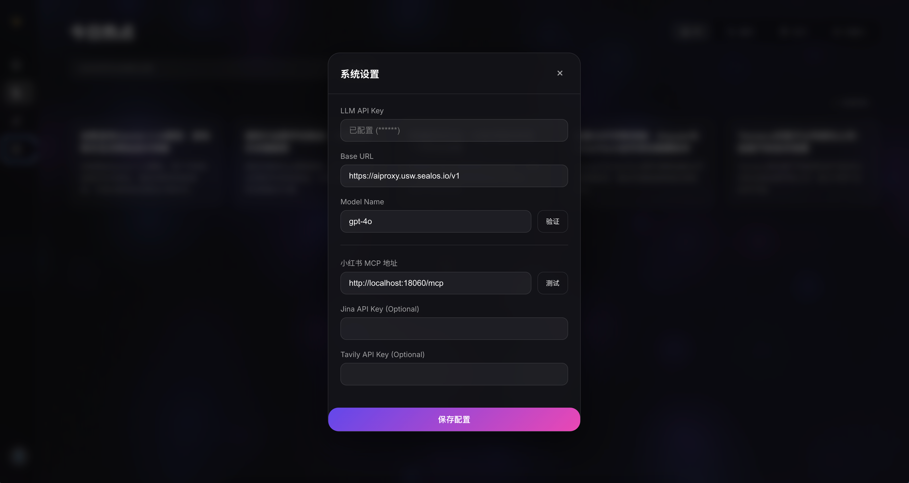
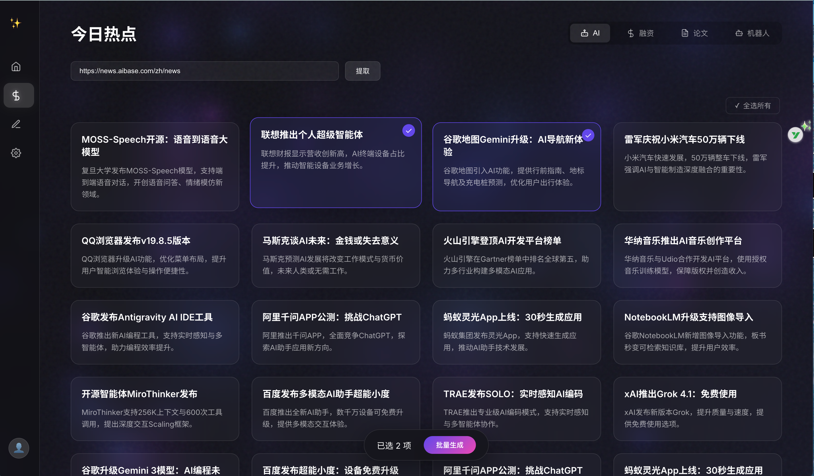
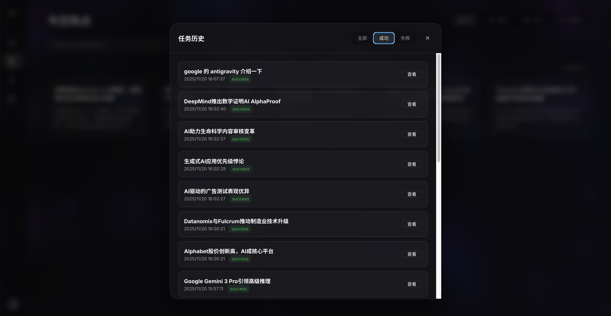
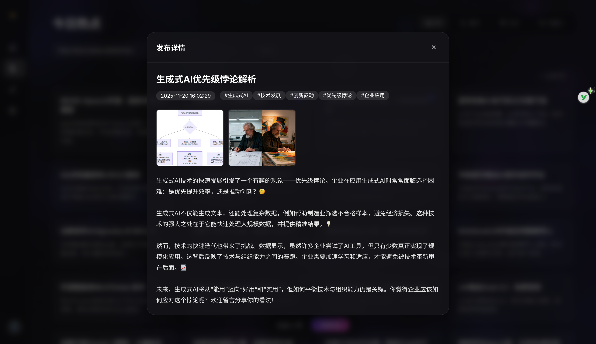

# Xiaohongshu AI Content Generation & Publishing System

[中文](README.md) | English

An AI-powered intelligent Xiaohongshu (Little Red Book) content generation and automatic publishing web application. It integrates multiple tool services through MCP (Model Context Protocol) to achieve a fully automated workflow from topic input to content publishing.

In simple terms: Input a topic and AI handles everything for you, publishing directly to your Xiaohongshu account

System main interface:





## ✨ Features

- 🎨 **Modern Web Interface** - Clean and beautiful left-right panel layout with responsive design
- ⚙️ **Configuration Management** - All configurations input through web interface, automatically saved to config files
- 🔌 **MCP Service Integration** - Integrates three major MCP services: Jina Search, Tavily Search, and Xiaohongshu Publishing
- 🤖 **Intelligent Content Generation** - Automatically retrieves information, analyzes, and writes articles based on user topics
- 📝 **Auto Formatting** - Automatically adapts to Xiaohongshu publishing format (title, content, tags, images)
- 🚀 **One-Click Publishing** - Automatically publishes to Xiaohongshu platform after generation
- 📊 **Real-time Progress** - Displays execution progress and status information
- ✅ **Result Display** - Shows final published title, content, tags, images, etc.
- 🔥 **Trending Topics Recommendation** - Automatically fetch today's trending news topics
- 🎯 **Batch Generation & Publishing** - Support batch selection of multiple topics for one-click generation
- 🌐 **URL Content Extraction** - Support inputting webpage links to crawl and extract topics
- 🏷️ **Domain Quick Filter** - Provides quick filter buttons for AI, Funding, Papers, Robotics domains

**A Quick Ad**

This is my personal account, all articles are written by this project


[Personal Homepage](https://www.xiaohongshu.com/user/profile/60857eed0000000001008826) Welcome to visit, follow me for first-hand AI resources


## 📋 Prerequisites

### 1. Start Xiaohongshu MCP Service

**You must first start the [xiaohongshu-mcp](https://github.com/xpzouying/xiaohongshu-mcp) service**


```bash
# 1. Clone the Xiaohongshu MCP project
git clone https://github.com/xpzouying/xiaohongshu-mcp.git
cd xiaohongshu-mcp

# 2. Start the service following the project README instructions
# Default service address: http://localhost:18060/mcp
```
⚠️Note: You need to log in to your Xiaohongshu account first (follow the login method in the MCP service)
### 2. System Environment

- Python 3.8+
- Node.js 16+ (for MCP tools)
- npm/npx (for running MCP tools)

## 🚀 Quick Start

### 1. Install Dependencies

```bash
cd xhs_web_app
pip install -r requirements.txt
```

### 2. Start Application

```bash
python app.py
```

The application starts by default at `http://localhost:8080`.

### 3. Configure System

Visit `http://localhost:8080` and configure the following information in the left panel:

#### Required Configuration

| Configuration | Description | Example |
|--------|------|------|
| **LLM API Key** | OpenAI-compatible API key | `sk-xxx...` |
| **OpenAI Base URL** | API base address | `https://api.openai.com/v1` or `https://usw.sealos.io/v1` |
| **Default Model** | LLM model to use | `claude-sonnet-4-20250514` (recommended) |
| **Xiaohongshu MCP Service URL** | MCP service URL | `http://localhost:18060/mcp` |

#### Optional Configuration

| Configuration | Description | How to Get |
|--------|------|----------|
| **Jina API Key** | Jina search service key | [Jina Official Site](https://jina.ai/) |
| **Tavily API Key** | Tavily search service key | [Tavily Official Site](https://tavily.com/) |

Recommend using Tavily as the search tool, which offers 1000 free search requests per month

> 💡 **Tip**: Click the "Get Key" or "View Documentation" links next to configuration items to jump directly to the corresponding service websites.


### 4. Content Generation

The system features a brand new immersive dual-view design:

#### Method 1: Creation Center (Home View)

This is the default view, focused on deep creation of a single topic.

1. **Input Topic**: Enter the topic you want to create in the input box below "What will you create today?" in the center of the screen.
2. **Start Generation**: Click the "✨ Generate" button on the right.
3. **Real-time Status**:
   - A "Current Task Status Card" will automatically pop up below the input box.
   - You can see the steps AI is performing (Retrieving Data -> Writing Article -> Formatting -> Auto Publishing).
   - The progress bar updates in real-time to show the current execution percentage.

**Topic Example:**
- "Analysis of the Priority Paradox of Generative AI"


#### Method 2: Trending Discovery (Trending View)

Click the "🔥 Trending" icon in the left sidebar to enter this view, suitable for finding inspiration and batch production.

##### 1. Get Trending Topics by Domain
At the top of the page, click the glassmorphism-style domain tabs to quickly get trending topics in that field:
- 🤖 **AI** - Frontier dynamics of AI and Large Models
- 💰 **Funding** - Latest financing news in the venture capital circle
- 📄 **Papers** - Latest research results in academia
- 🦾 **Robotics** - Embodied intelligence and automation technology

##### 2. Extract from Web Link
If you have a specific article link:
1. Paste the URL into the "Or paste web link to extract topics..." input box.
2. Click the "Extract" button, and the system will intelligently analyze the web content and refine core topics.

##### 3. Batch Generation & Publishing
After getting topic cards:
1. **Select Topics**: Click on topic cards you are interested in (cards will highlight and show a ✓ mark).
2. **Select All**: Click the "✓ Select All" button above the list to select all current topics with one click.
3. **Batch Execution**:
   - A "Batch Action Bar" will automatically float at the bottom, showing the selected count.
   - Click the "🚀 Batch Generate Selected Topics" button.
   - The system will automatically create a task queue and process the generation and publishing of each topic in sequence.

#### Task History & Management
Click the "📝 History" icon in the left sidebar to open the history modal:
- **View Details**: Click the "View" button of any task to preview the complete generated Xiaohongshu copy (title, content, tags) and images.
- **Status Filter**: Use the segmented control at the top (All/Success/Failed) to quickly filter task status.


## 📂 Project Structure

```
xhs_web_app/
├── app.py                      # FastAPI main program
├── requirements.txt            # Python dependencies
├── README.md                   # This document
│
├── config/                     # Configuration module
│   ├── __init__.py
│   ├── config_manager.py       # Configuration manager
│   ├── app_config.json         # App config (auto-generated)
│   ├── servers_config.json     # MCP server config (auto-generated)
│   └── .env                    # Environment variables (auto-generated)
│
├── core/                       # Core functionality module
│   ├── __init__.py
│   ├── content_generator.py    # Content generator (based on MCP tool execution)
│   └── xhs_llm_client.py       # MCP client and LLM interaction
│
├── cache/                      # Cache module
│   ├── __init__.py
│   ├── cache_manager.py        # Task history cache manager
│   └── task_history.json       # Task history records (auto-generated)
│
├── static/                     # Static resources
│   ├── css/
│   │   └── style.css          # Style file
│   └── js/
│       └── app.js             # Frontend interaction logic
│
└── templates/                  # HTML templates
    └── index.html             # Main page
```

## 🔧 Configuration File Description

### 1. app_config.json

Stores main application configuration:

```json
{
  "llm_api_key": "sk-xxx...",
  "openai_base_url": "https://api.openai.com/v1",
  "default_model": "claude-sonnet-4-20250514",
  "jina_api_key": "jina_xxx...",
  "tavily_api_key": "tvly_xxx...",
  "xhs_mcp_url": "http://localhost:18060/mcp"
}
```

### 2. servers_config.json

MCP server configuration (auto-generated based on app_config.json):

```json
{
  "mcpServers": {
    "jina-mcp-tools": {
      "command": "npx",
      "args": ["jina-mcp-tools"],
      "env": {
        "JINA_API_KEY": "jina_xxx..."
      }
    },
    "tavily-remote": {
      "command": "npx",
      "args": ["-y", "mcp-remote", "https://mcp.tavily.com/mcp/?tavilyApiKey=tvly_xxx..."]
    },
    "xhs": {
      "type": "streamable_http",
      "url": "http://localhost:18060/mcp"
    }
  }
}
```

## 🎯 Content Generation Process

The system uses a 4-step workflow to automatically generate and publish content:

### Step 1: Information Retrieval
- Uses Jina or Tavily search tools
- Retrieves latest information from the past 7-30 days
- Collects 5-8 high-quality resources
- Obtains 3-4 related images

### Step 2: Article Writing
- Writes professional articles based on collected materials
- Title limited to 20 characters
- Content 800-1200 words
- Uses youthful and lively language style
- Appropriately adds emojis for engagement

### Step 3: Format Adaptation
- Adjusts to Xiaohongshu-specific format
- Removes # tags, converts to natural language
- Extracts 5 precise topic tags
- Validates image link availability
- Generates standard JSON format

### Step 4: Auto Publishing
- Calls Xiaohongshu MCP service
- Publishes content to Xiaohongshu platform
- Returns publishing results
- **Automatically stops iteration upon successful publishing**

## 🌐 API Endpoints

| Method | Path | Description |
|------|------|------|
| GET | `/` | Main page |
| GET | `/api/config` | Get configuration (hides sensitive info) |
| POST | `/api/config` | Save configuration |
| POST | `/api/validate-model` | Validate if LLM model is available |
| POST | `/api/test-login` | Test Xiaohongshu MCP connection |
| POST | `/api/generate-and-publish` | Generate and publish single topic |
| POST | `/api/fetch-trending-topics` | Fetch today's trending topics (supports domain filter) |
| POST | `/api/fetch-topics-from-url` | Crawl and extract topics from URL |
| POST | `/api/batch-generate-and-publish` | Batch generate and publish multiple topics |
| GET | `/api/history` | Get task history records |
| DELETE | `/api/history/{task_id}` | Delete specified task record |
| GET | `/api/history/statistics` | Get task statistics |

## 🛠️ Tech Stack

### Backend
- **FastAPI** - Modern web framework
- **MCP (Model Context Protocol)** - Tool service integration
- **OpenAI SDK** - LLM API calls
- **aiohttp** - Async HTTP client

### Frontend
- **Native HTML/CSS/JavaScript** - Lightweight, no build required
- **Element UI Style** - Clean and beautiful UI design
- **Responsive Layout** - Supports desktop and mobile

### MCP Tool Services
- **Jina MCP Tools** - Web search and content scraping
- **Tavily Remote** - Deep web search
- **XHS MCP** - Xiaohongshu content publishing

## 📝 License

This project is for learning and research purposes only. When using this project, please comply with:
- OpenAI API Terms of Service
- Xiaohongshu platform rules
- Terms of service for each MCP service provider

## 🔗 Related Links

- [Xiaohongshu MCP Service](https://github.com/xpzouying/xiaohongshu-mcp) - Required dependency service
- [Sealos API Platform](https://usw.sealos.io/) - Get LLM API key
- [Jina AI](https://jina.ai/) - Get Jina API key
- [Tavily](https://tavily.com/) - Get Tavily API key

## 📧 Support & Feedback

For questions or suggestions, welcome to:
- Submit Issues
- Create Pull Requests
- Contact project maintainers


## ⚠️ Final Notes
This project can serve as a learning case for agents, but is not recommended for direct production use.

The overall project logic is abstracting a more general agent architecture:
- Configurable MCP
- Select different tools to complete complex tasks
- Agent context retrieval and compression
- Agent multi-turn dialogue and memory
- .....

---
**Welcome to star! Happy Creating! 🎉**